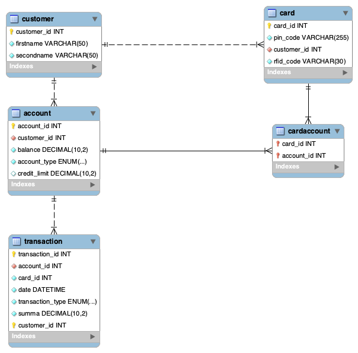

## **💖 Barbie ATM**

A Software Development Application Project

### 📖 Description

Barbie ATM is a fully functioning, Barbie‑themed automated teller machine that allows users to manage their bank accounts in a fun and colorful way. While the design is playful, the system itself is a serious software project integrating a Qt frontend, Node.js  backend, MySQL database, and RFID authentication.

The project was developed by a team of four. Each member initially focused on one component: 
* 🌸 Frontend Application (Qt)
* 🔧 Node.js API (REST backend)
* 🗄️ MySQL Database
* 🔄 Node.js Interface (API integration with the database)

Throughout development, everyone contributed across components to strengthen collaboration and deepen full‑stack understanding. The project allowed us to apply skills from Object‑Oriented Programming, SQL, JavaScript, and team‑based software development. 

### ✨ Features

Users log in with their BarbieCard (RFID) and PIN. After authentication, they can:
* 💰 Check account balances
* 📜 View transaction history
* ➕ Make deposits
* ➖ Withdraw money
* 🔄 Transfer funds between accounts

Additional implemented features:
* **Credit + Debit in one card**
* **Multiple credit card type**s (Premium, Platinum, Gold) with different limits
* **Savings account** earning 2% annual interest for 5 years (locked during the period)
  
The Qt frontend communicates with the Node.js  backend via a REST API, which handles all database operations.

### 🛠 Technologies

* **Frontend:** C++ with Qt Framework
* **Backend:** Node.js, Express
* **Database:** MySQL
* **Architecture:** REST API
* **Tools:** Postman, GitHub, RFID DLL

### 📸 Gallery

#### Login Interface
Shows card number input, PIN entry, and attempt counter.

#### Main Menu (Logged In) 
Options for balance, transactions, deposit, withdraw, transfer, and logout. 

 

#### Transaction History Demonstrates working backend + database communication. 
A popup window showing the user’s last 10 transactions. Demonstrates correct backend + database communication.

## ER-diagram

### Documentation

A full project report (PDF) is available, including architecture diagrams, methods, results, and conclusions.

### 👨‍💻 Developers

Aliisa Alalammmi - https://github.com/liisasalami

Meri-Tuulia Turtinen - https://github.com/m351351

Pilar Murcia Pozuelo - https://github.com/tecnopistacho

Yvonne Frankort - https://github.com/YvonneFrankort

### 📄 License

Barbie ATM - Group 2, 2025
Licensed for educational and creative project use 💅✨

